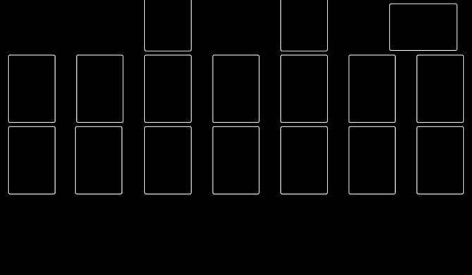
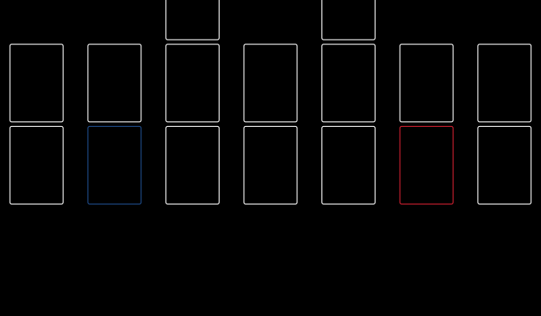

# YGO PLAYMAT GENERATOR

## Why?

I am a big fan of YuGiOh trading card game. I want to have unique playmats with
zone, I have search templates online but none of them fit my requirement. I
know how to make a zone template with photo editor, but it is a lot of work to
make it perfectly align. Zones are just rectangles why not draw they with SVG.

## Size

If you shop on Taobao, Aliexpress, Ebay for playmat, they will give you a
playmat in 600mm x 350mm, a little bit smaller than official playmat but it is
OK if the zone are matched, you don't want the EX zone not match.

Some measurement from my playmat:

- per slot size: 86mm x 59mm, card without sleeve is 86mm x 59mm
- gaps for slots: horizontal is 27.5mm, vertical is 5mm

For printing, we want 300 DPI, ~12 pixels per mm, 600mm x 350mm = 7200 pixels
x 4200 pixels.

## How to use

You will need to run a http server to use this tool. Then access main.html.
I also host an online version, you can access on: PENDING.

## Example

### With banish zone

### Change color for Pendulum zone

### Generated with background picture

Photo Credit: [NASA](https://images.nasa.gov/details-PIA12348)

## License

Apache-2.0